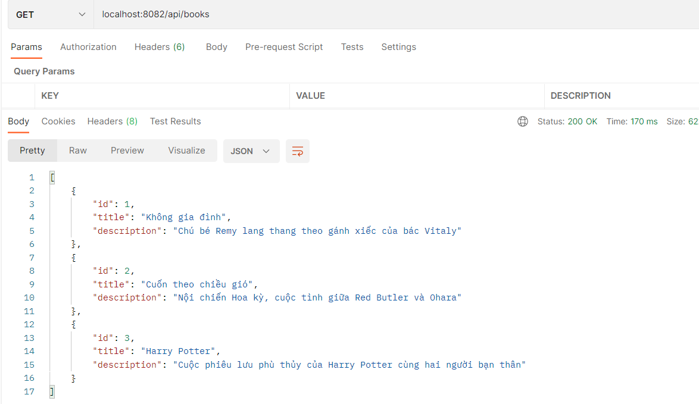
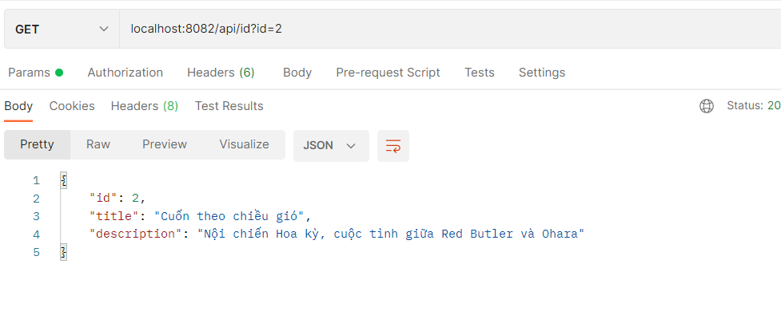
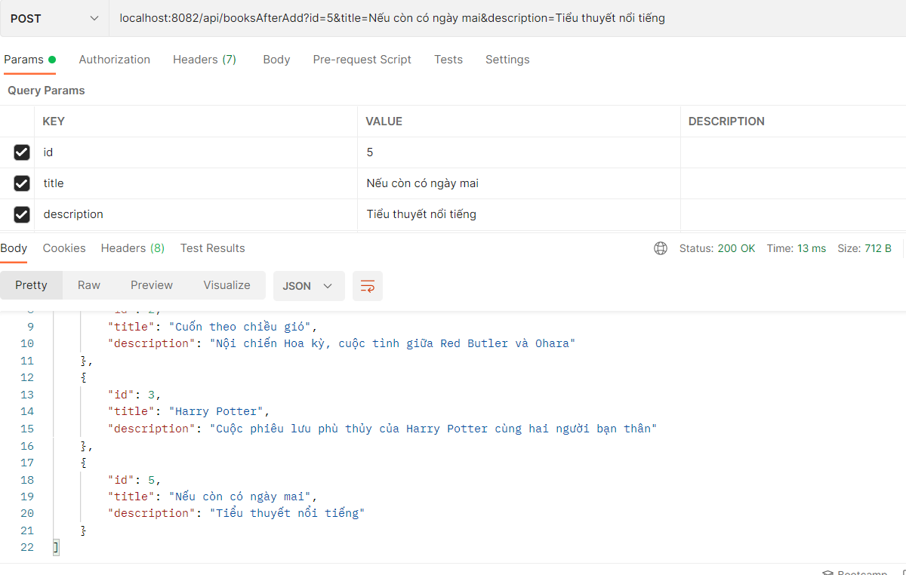
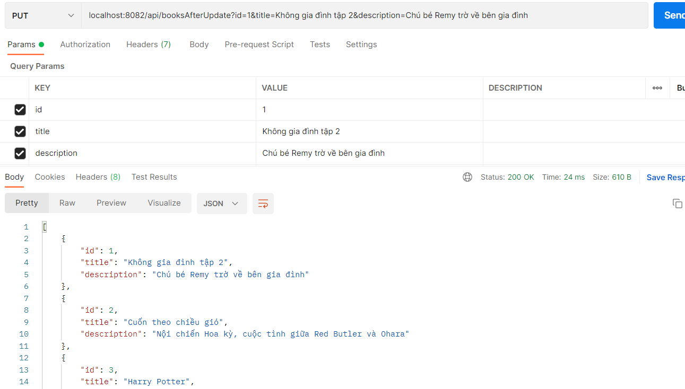
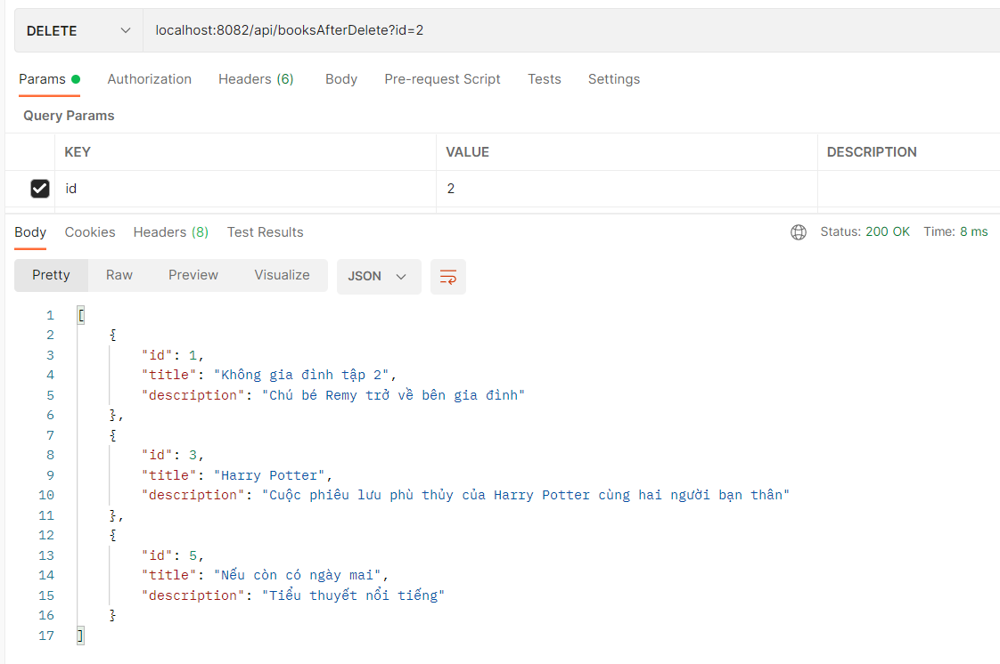

### 1. Tạo các medthod trong `BookDao.java`
```java
public class BookDao extends Dao<Book> {

  public BookDao() {
    collections.add(new Book(1, "Không gia đình", "Chú bé Remy lang thang theo gánh xiếc của bác Vitaly"));
    collections.add(new Book(2, "Cuốn theo chiều gió", "Nội chiến Hoa kỳ, cuộc tình giữa Red Butler và Ohara"));
    collections.add(new Book(3, "Harry Potter", "Cuộc phiêu lưu phù thủy của Harry Potter cùng hai người bạn thân"));
  }

  @Override
  public List<Book> getAll() {
    return collections;
  }

  @Override
  public Optional<Book> get(int id) {
    return Optional
        .ofNullable(collections.stream().filter(book -> book.getId() == id).collect(Collectors.toList()).get(0));
  }

  @Override
  public void add(Book t) {
    collections.add(t);
  }

  @Override
  public void update(int id, Book t) {
    int index = -1;
    for (int i = 0; i < collections.size(); i++) {
      if (collections.get(i).getId() == id) {
        index = i;
        break;
      }
    }
    collections.set(index, t);
  }

  @Override
  public void deleteByID(int id) {
    collections.removeIf(book -> book.getId() == id);
  }

}
```

### 2. Tạo file `RESTController.java`
```java
@RestController
@CrossOrigin
@RequestMapping("/api")

public class RESTController {

    BookDao bookDao = new BookDao();

    @GetMapping("/books")
    public ResponseEntity<List<Book>> listBooks() {
        return ResponseEntity.ok().body(bookDao.getAll());
    }

    @GetMapping("/id")
    public ResponseEntity<Optional<Book>> getBookById(@RequestParam(value = "id") int id) {
        BookDao bookDao = new BookDao();
        return ResponseEntity.ok().body(bookDao.get(id));
    }

    @PostMapping("/booksAfterAdd")
    public ResponseEntity<List<Book>> addBooks(@RequestParam(value = "id") int id,
            @RequestParam(value = "title") String title, @RequestParam(value = "description") String description) {
        bookDao.add(new Book(id, title, description));
        return ResponseEntity.ok().body(bookDao.getAll());
    }

    @PutMapping("/booksAfterUpdate")
    public ResponseEntity<List<Book>> updateBook(@RequestParam(value = "id") int id,
            @RequestParam(value = "title") String title, @RequestParam(value = "description") String description) {
        bookDao.update(id, new Book(id, title, description));
        return ResponseEntity.ok().body(bookDao.getAll());
    }


    @DeleteMapping("/booksAfterDelete")
    public ResponseEntity<List<Book>> deleteBook(@RequestParam(value = "id") int id) {
        bookDao.deleteByID(id);
        return ResponseEntity.ok().body(bookDao.getAll());
    }

}
```
### 3. Check kết quả trên Postman
a. Method GET - Lấy ra listBooks ban đầu


b. Xem chi tiết một đầu sách theo id


c. Thêm mới một đầu sách


d. Cập nhật một đầu sách theo id


d. Xóa một đầu sách theo id
